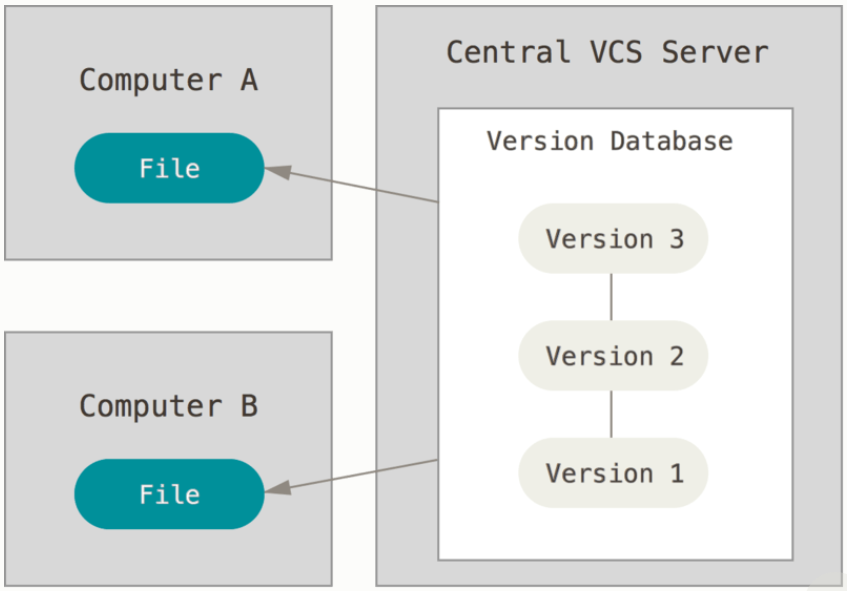

# [Git]

## 1. 버전 관리

- 버전 관리 시스템 (VCS, Version Control System)
  - 파일 변화를 시간에 따라 기록, 특정 시점 버전 관리
  - **"로컬 버전 관리"**
    - 간단한 데이터베이스를 사용해서 파일의 변경 정보 관리
    - ex) RCS(Revsion Control System)
    - 
  - **"중앙집중식 버전관리 (CVCS, Central VCS)"**
    - 별도의 파일 관리 서버
    - 클라이언트가 중앙 서버에서 파일 받아서 사용(Checkout)
    - 단점
      - 중앙 서버에 문제 발생 시 업무 및 백업 불가
    - 
  - **"분산 버전 관리 시스템 (DVCS)"**
    - Git, Mecuial, Bazaar, Darcs 등
    - 저장소를 히스로티와 더불어 전부 복제
      - 서버에 문제 발생 시 복제물로 다시 작업 가능
      - 클라이언트 중 아무거나 사용해서 백업 가능
    - 

## 2. Git 기초

- 기존 디렉토리 Git 저장소로 만들기
  - 사용할 프로젝트 디렉토리로 이동
  - `git init`
    - .git이라는 하위 디렉토리 생성
    - 저장소에 필요한 Skeleton 파일 생성
  - 저장소에 파일 추가 및 커밋
    - `git add *.c`
    - `git commit -m 'first commit`

- 기존 저장소 Clone하기
  - 프로젝트의 히스토리를 전부 받아옴
  - `git clone https:url`

- Git commit
  - Git 저장소에 디렉토리에 있는 모든 파일에 대한 스냅샷을 기록하는 것
  - 전체를 복사하지 않고 변경내역(delta)을 저장하여 커밋을 가볍게 유지

## 3. Git Branch

- Git의 데이터 저장 방식
  - Change Set이나 변경사항으로 기록하지 않고 스냅샷으로 기록
  - 커밋하면 Git은 현 Staging Area에 있는 데이터의 스냅샷에 대한 포인터, 저자나 커밋 메시지 같은 메타데이터, 이전 커밋에 대한 포인터 등을 포함하는 커밋 객체를 저장
  - 파일 3개를 커밋하면 각 파일에 대한 Blob 세개, 파일과 디렉토리 구조가 담긴 트리 개체 하나, 메타데이터와 루트 트리를 가리키는 포인터가 담긴 커밋 개체 하나 생성

- 브랜치는 커밋 사이를 가볍게 이동할 수 있는 포인터 같은 것

- 브랜치 생성
  - `git branch '브랜치명'`
  - HEAD라는 특수한 포인터로 현재 작업 중인 로컬 브랜치 가리킴
  - 현재 작업 브랜치 확인
    - `git log --oneline --decorate`

- 브랜치 이동
  - `git checkour testing`

  - 현 상태에서 새로운 커밋
    - `git commit -a -m 'make change'`

  - master 브랜치로 돌아와서 새로운 커밋
    - `git checkout master`
    - `git commit -a -m 'make other change'`

  - 히스토리 확인
    - `git log --oneline --decorate --graph --all`

- 출처 : https://git-scm.com/book/ko/v2