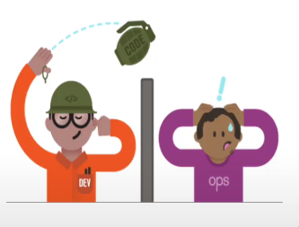

# Issue Tracking

#### Issue
- 팀이 수행할 일
- 이슈가 어떤 상태인지 트래킹

# Agile
- 개발 철학, 개발 선언
- 문서보다 실제 작동하는 소프트웨어에 집중
- 작동하는 소프트웨어를 개발하고 그 후 변화에 대응

# SCRUM vs KANBAN
- SCRUM
  - sprint 생성
  - scrum meeting
- KANBAN
  - 담당자별로 할 일 할당

# DevOps
- 개발팀이 개발하고 운영팀에 넘긴다
- 운영팀이 배포하고 관리한다
- 개발-운영의 전형적인 악순환 발생
- 
- 개발-운영이 한 팀인 것처럼 진행하자
- CI-CD를 사용해 빠르게 배포
- Jira가 하나의 지표와 일정 관리에 도움을 줌

# SRE (Site Reliability Engineering)
- Jira는 협업과 communication 측면에서 도움이 됨

# Create Issue
- Story : 메인 개발 업무
- Task : 주요 업무 외 업무 (실제론 구분 없기도 함)
- Bug : 버그
- Epic : 하나의 큰 항목, 분류, 기능

# JQL (Jira Query Language)
- Jira Issue를 구조적으로 검색하기 위해 제공하는 언어
- SQL(Standard)과 비슷한 문법
- 각 필드들에 맞는 특수한 예약어들을 제공
- 쌓인 Issue들을 재가공하여 유의미한 데이터를 도출해 내는데 활용

