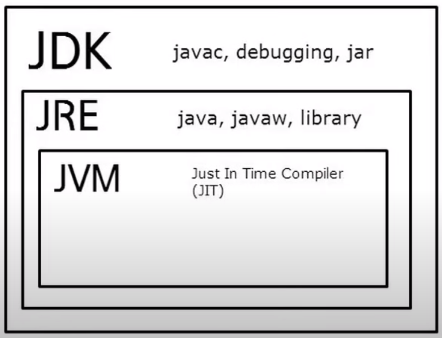
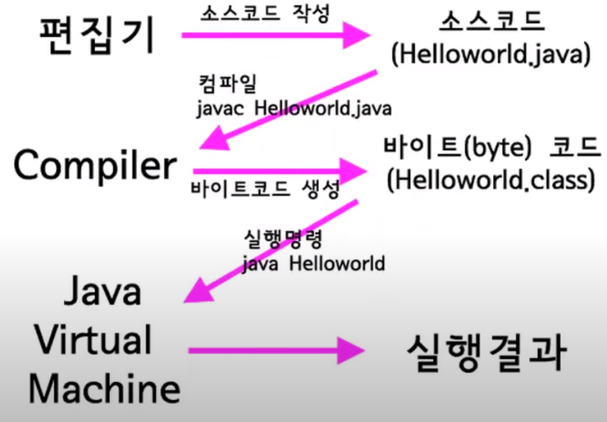

# [Java]

#### Java 플랫폼

- Java SE, Standard Edition
  - Application, Applet, JDBC, RMI, CORBA, XML..
  - 기본 Java 언어 표준안
- Java EE, Enterprise Edition
  - Servlet/JSP, EJB, JMS, Web-service, Vonnector, JNF, JavaMail..
  - 기업용 서버프로그래밍에 사용되는 기술셋 정의
- Java ME, Micro Edition
  - MIDlet..
  - 모바일 개발, 소형기기 지원
  

#### JDK, Java Development Kit

- 개발자 용
- 자바를 개발하는데 필요한 여러 도구를 모아놓은 소프트웨어
- Java 코드 컴파일러와 JRE 포함, 자바를 사용하기 위해 반드시 필요

#### JRE, Java Runtime Environment

- 일반인 용
- 자바 코드대로 프로그램을 생성해주는 역할 
- 실제로 동작하는데 필요한 JVM, 라이브러리, 각종 파일 포함

#### JVM, Java Virtual Machine

- 자바가 실제로 구동하는 환경
- 하드웨어나 운영체제에 따른 호환성의 문제는 버전에 따라 만들어진 JVM이 알아서 해결

#### Maven / Gradle

###### Springboot Starter(Gradle)

- 필요한 라이브러리를 가져오고 빌드하는 LifeCycle까지 관리 (gradle이 우세)
- 의존 관계 관리
  - External libraries에 담겨있음

- Dependancies
  - 라이브러리간 의존 관계 

#### Java 특징

- **"객체지향 언어"**
  - SW 시스템을 기본 구성이 객체(Object) 단위로 구성, 객체간 관계 구성
  - "Abstraction(추상화)"
    - 현상에 존재하는 객체의 주요 특징을 추출하는 과정
  - "Encapsulation(캡슐화)"
    - 하나의 클래스 안에 데이터와 기능을 담아 정의하고, 중요한 데이터나 복잡한 기능 등은 숨기고, 외부에서 사용에 필요한 기능만을 공개하는 것
  - "Inheritance(상속)"
    - 객체 정의 시 기존에 존재하는 객체의 속성과 기능을 상속받아 정의하는 것
  - "Polymorphism(다형성)"
    - 같은 타입 또는 같은 기능의 호출로 다양한 효과를 가져오는 것

  - 객체 : 멤버 변수, 메서드를 가진다
  - 속성 : 괄호 없는 것 / 메서드 : 괄호 있는 것
    - ex) System."out"(속성)."println()"(메서드)  
- **"Write Once, Run Anywhere"**
  - "멀티 스레드"
  - Thread API를 제공함으로써 운영체제에 종속적이지 않는 독립적인 설계 구현 
  - **바이트코드** (C++은 바이너리코드)
- 분산 프로그래밍 지원
  - 네트워크를 이용한 프로그래밍을 지원하고 원격 접속을 위한 다양한 기술셋 보유  
- **"Garbage Collection"**
  - 더 이상 사용하지 않는 메모리를 자동으로 정리하는 기능
  - C에서는 쓰레기 메모리 수거해줘야 함
  - 언제 발생하는지 정확히 알 수는 없음(언젠가 일어남)
  - 메모리 관리할 필요가 없는 것이 매우 큰 장점
- 파일 저장명은 public 클래스명으로 저장
  - .java 확장자
  - console 실행 명령어
    - compile: "javac -d . (파일명.java)"
    - run: "java (package명.클래스명)"
- Class
  - 자바프로그래밍 최소 단위
- **"Variable"**
  - 메모리 공간, 그릇
  - 메모리 공간에 값(value)을 할당(assign) 후 사용
  - 공간의 크기는 타입별로 달라짐
- **"Type"**
  - 변수에 저장되는 데이터의 종류
  - **Primitive Type(기본형)**
    - 미리 정해진 크기의 Memory Size로 표현
    - 변수 자체에 값 저장
    - 논리형
      - boolean
    - 정수형
      - byte : 8bit
      - short : 16bit
      - int(default) : 32bit
      - long : 64bit
    - 실수형
      - float : 32bit
      - double(default) : 64bit
    - 문자형
      - char : 16bit
  - **Reference Type(참조형)**
    - 미리 정해질 수 없는 데이터의 표현
    - 변수에는 실제 값을 참조할 수 있는 주소만 저장
- local 변수는 사용전에 초기화 필요
- "final"
  - ex) final int i = 0;
  -    i = 10
  - final로 정의한 변수는 변경 불가
  - blank 상태면 가능
  - ex) final int i;
  -    i = 10

#### 컴파일

- 소스코드(사람이 이해할 수 있는 코드)를 byte코드(컴퓨터가 이해할 수 있는 코드)로 전환
- Javac가 컴파일 해준다(컴파일러)
  - .class 파일 생성
  

#### 형변환(Type casting)

- primitive는 primitive끼리, reference는 reference끼리 변환 가능
- 다른 타입 변환을 위해 Wrapper 클래스 사용
- "명시적 형변환"
  - 큰집 → 작은집 
  - 데이터 손실 있음
  - byte b = (byte) i; 
    - 형변환 연산자 필요
- "묵시적 형변환"
  - 작은집 → 큰집
  - 데이터 손실 없음
  - long이 64bit이고 float이 32bit이지만 타입의 크기가 아닌 타입의 표현 범위가 커지는 방향으로 할당

#### SI (System Integration)

- 시스템 통합
  - 기관이나 기업의 업무 관리를 소프트웨어화하는 것
  - ex) 삼성 SDS(SI업체), 홈페이지, 학사 시스템, 병원 진료 시스템, 생산 시스템..

#### 문자와 문자열

- 자바는 내부적으로 문자와 문자열을 다르게 처리
- 문자는 ''(작은따옴표)로 감싸야 한다.
- 문자열은 ""(큰따옴표)로 감싸야 한다.
  - 한 글자도 쌍따옴표로 감싸면 문자열로 처리

- 쌍따옴표 표시 : \"
- 줄바꿈 : \n

참조 : https://www.youtube.com/channel/UCvc8kv-i5fvFTJBFAk6n1SA